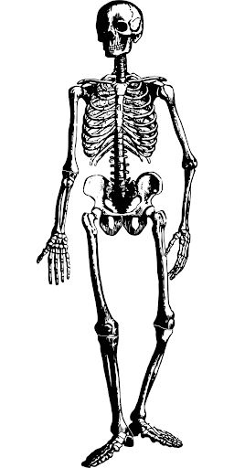
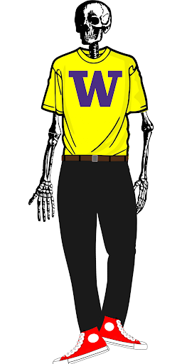
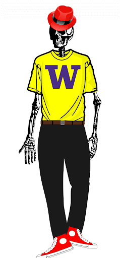
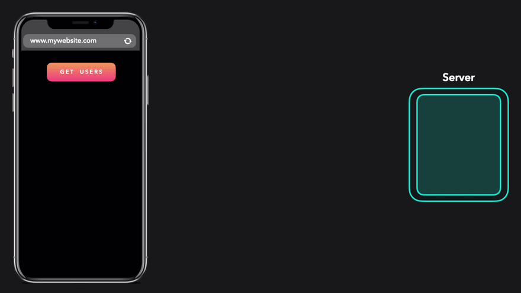

<!--
author:   Andrea Charão

email:    andrea@inf.ufsm.br

version:  0.0.1

language: PT-BR

narrator: Brazilian Portuguese Female

comment:  Material de apoio para a disciplina
          ELC1090 - Desenvolvimento de Software para Web
          da Universidade Federal de Santa Maria

translation: English  translations/English.md
-->

<!--
liascript-devserver --input README.md --port 3001 --live
https://liascript.github.io/course/?https://raw.githubusercontent.com/AndreaInfUFSM/elc1090-2026b/master/classes/03/basics/README.md
-->


[](https://liascript.github.io/course/?https://raw.githubusercontent.com/AndreaInfUFSM/elc1090-2026b/master/classes/03/basics/README.md)


# Web Basics

Para começar, uma analogia!

Simplificando, podemos resumir a Web em 4 itens: 

Conteúdo, Estrutura, Estilo, Comportamento

  
  
  
  


## Protocolo HTTP

Falando mais tecnicamente... 

Web é uma aplicação de protocolos de rede e de linguagens


### Arquitetura cliente-servidor 

- Conceito de sistemas distribuídos (antes da Web)
- Classicamente, browser é cliente (user-agent) que faz requisições aos servidores
- Protocolo HTTP (HyperText Transfer Protocol) define regras para esta interação


Mais animadamente:



Fonte: https://dev.to/lydiahallie/cs-visualized-cors-5b8h


Mais sobre HTTP em: 

- Mozilla. An overview of HTTP. https://developer.mozilla.org/en-US/docs/Web/HTTP/Overview
- Barry Pollard. HTTP/2 in Action. https://www.amazon.com/dp/1617295167?tag=uuid10-20&asin=1617295167&revisionId=&format=4&depth=1 (não cobre HTTP/3, mas ainda tem informações atuais)

### URLs

- Requisições HTTP acessam **recursos** na web
- Uniform Resource Locator (URL) identifica recursos na web 
- Geralmente, quando falamos de "endereço web", estamos nos referindo a uma URL
- Principais elementos na escrita de URLs (sintaxe): protocolo, nome do domínio, porta, path, parâmetros na URL

  ```
  https://www.example.com:80/path/to/myfile.html?key1=value1&key2=value2
  ```


Mais sobre isso em: https://developer.mozilla.org/en-US/docs/Web/URI

### Requisições/respostas

Mensagens HTTP que trafegam pela rede são requisições ou respostas.

Exemplo de requisição enviada pelo cliente:


Exemplo de resposta do servidor:


Mais sobre isso em: https://developer.mozilla.org/en-US/docs/Web/HTTP/Messages


## Browser e DOM

Navegadores modernos são quase um "sistema operacional" :-)

Este tutorial aprofundado (Inside look at modern web browser) começa explicando threads e processos:

- Part 1: https://developer.chrome.com/blog/inside-browser-part1/
- Part 2: https://developer.chrome.com/blog/inside-browser-part2/
- Part 3: https://developer.chrome.com/blog/inside-browser-part3/
- Part 4: https://developer.chrome.com/blog/inside-browser-part4/

### Document Object Model

[Document Object Model](https://developer.mozilla.org/en-US/docs/Web/API/Document_Object_Model): *connects web pages to scripts or programming languages by representing the structure of a document*

Ilustração ([part 3](https://developer.chrome.com/blog/inside-browser-part3/)): The main thread parsing HTML and building a DOM tree


## HTML

- Hypertext Markup Language (HTML)
- Descreve conteúdo + estrutura de uma página web
- Usa *tags* para estruturar o conteúdo (início e fim) 

Exemplo (HTML5):

```html
<!DOCTYPE html>
<html>
  <head>
    information about the page
  </head>
  <body>
    <header>
      <!-- Header of the webpage body (e.g. logo, navigation bar) -->
    </header>
    <main>
      <!-- Main section of the webpage body (where most content is) -->
      <p>This is a paragraph</p>
    </main>
    <footer>
      <!-- Footer of the webpage body (e.g. copyright info) -->
    </footer>
  </body>
</html>
```


Mais em:


- Basic HTML syntax: https://developer.mozilla.org/en-US/docs/Learn/HTML/Introduction_to_HTML/Getting_started
- Structuring documents: https://developer.mozilla.org/en-US/docs/Learn/HTML/Introduction_to_HTML/Document_and_website_structure
- Solve common HTML problems: https://developer.mozilla.org/en-US/docs/Learn/HTML/Howto
- HTML Tutorial: https://www.w3schools.com/html/

### Lista completa de tags

São muuuitas!

HTML elements reference: https://developer.mozilla.org/en-US/docs/Web/HTML/Element

## CSS

- Cascading Style Sheets (CSS)
- Descreve a aparência e o layout de uma página web (complementando HTML, que descreve o conteúdo/estrutura)
- Especificações: https://www.w3.org/Style/CSS/specs.en.html
- Código em arquivo .css referenciado no .html


Exemplo no `<head>`:

```html
<head>
  ...
  <link rel="stylesheet" href="https://maxcdn.bootstrapcdn.com/bootstrap/3.4.1/css/bootstrap.min.css">
  ...
</head>  
```

### Sintaxe


Rules = selectors + properties


- Arquivo CSS = uma ou mais regras (rules)
- Básico: rules = selectors + properties

  - Selector: quais elementos da página devem ser estilizados (https://developer.mozilla.org/en-US/docs/Web/CSS/Reference#selectors)
  - Property: estilos que serão aplicados aos elementos
- Cada property tem um conjunto de valores possíveis
- Muuuitas propriedades: https://developer.mozilla.org/en-US/docs/Web/CSS/Reference

Forma geral:

```css
  selectors-list {
    properties-list
  }
```

Exemplo:

```css
  strong {
    color: red;
  }
```

- `strong`: seletor
- `color`: propriedade
- `red`: valor da propriedade

Mais em:

- CSS: Styling the content: https://developer.mozilla.org/en-US/docs/Learn/Getting_started_with_the_web/CSS_basics
- Solve common CSS problems: https://developer.mozilla.org/en-US/docs/Learn_web_development/Howto/Solve_CSS_problems
- CSS Tutorial: https://www.w3schools.com/css/default.asp


# Static Websites

- Web site é software?
- O que é um 'site estático' ?

  - Segundo Wikipedia: *"a web page that is delivered to a web browser exactly as stored"* (https://en.wikipedia.org/wiki/Static_web_page)
  - Outras definições:

     - https://www.w3schools.com/howto/howto_website_static.asp
     - https://www.sanity.io/static-websites


## Usos


- Páginas pessoais
- Portfolios pessoais ou corporativos
- Landing pages
- Sites de documentação
- Brochure sites

## Desenvolvimento

Básico:

- conteúdo
- criação

  - estrutura; código HTML
  - estilo: código CSS
- hospedagem/publicação/deploy


### Criação

- Editar manualmente HTML, CSS (pouco produtivo, mas vale fazer algumas vezes na vida)
- Aproveitar frameworks facilitadores, por exemplo:

  - Bootstrap: https://getbootstrap.com/ https://www.w3schools.com/bootstrap/
  - Tailwind: https://tailwindcss.com/ 
  - Ver: https://ritza.co/articles/tailwind-css-vs-bootstrap-vs-material-ui-vs-styled-components-vs-bulma-vs-sass/
- Static site generators: https://jamstack.org/generators/ 
- Abordagem moderna: JAMStack: JavaScript, API, Markup (para quem já sabe o básico)
- Para quem trabalha na área, vale olhar: https://www.netlify.com/blog/complete-guide-to-headless-cms/

### Hospedagem

Muitas opções de hospedagem gratuita:

- GitHub Pages

  - Exemplos: https://gsajulia.github.io/,  https://lorenzofman.github.io/

- Vercel
- Render
- Netlify
- Muitos outros...


