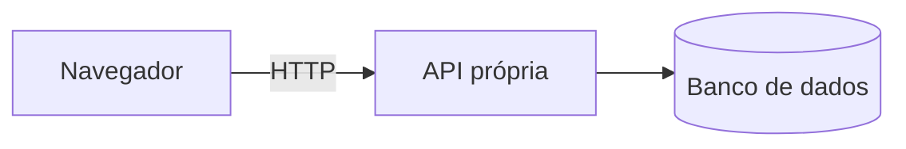
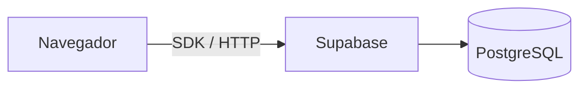
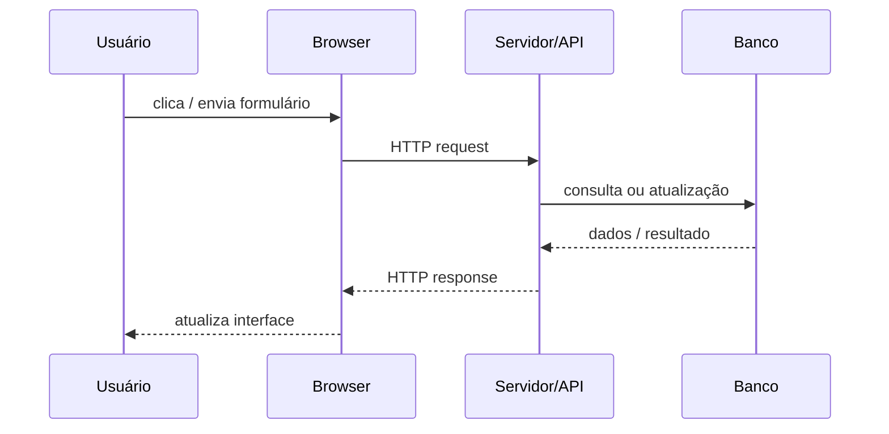
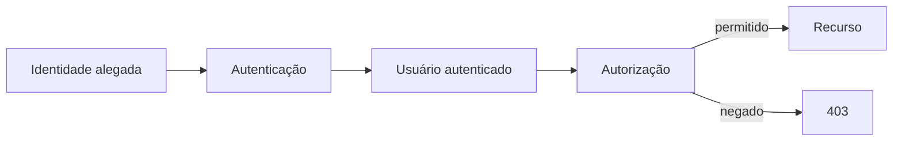
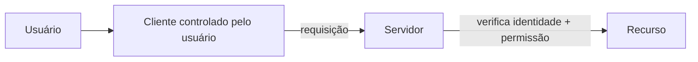
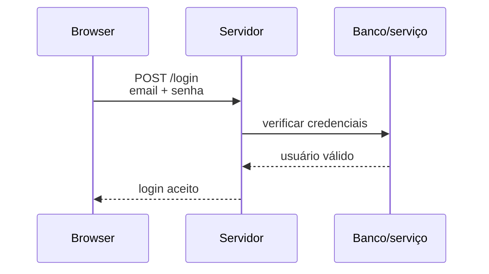
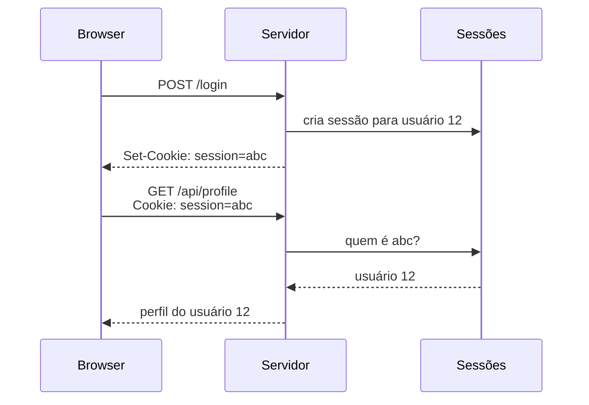
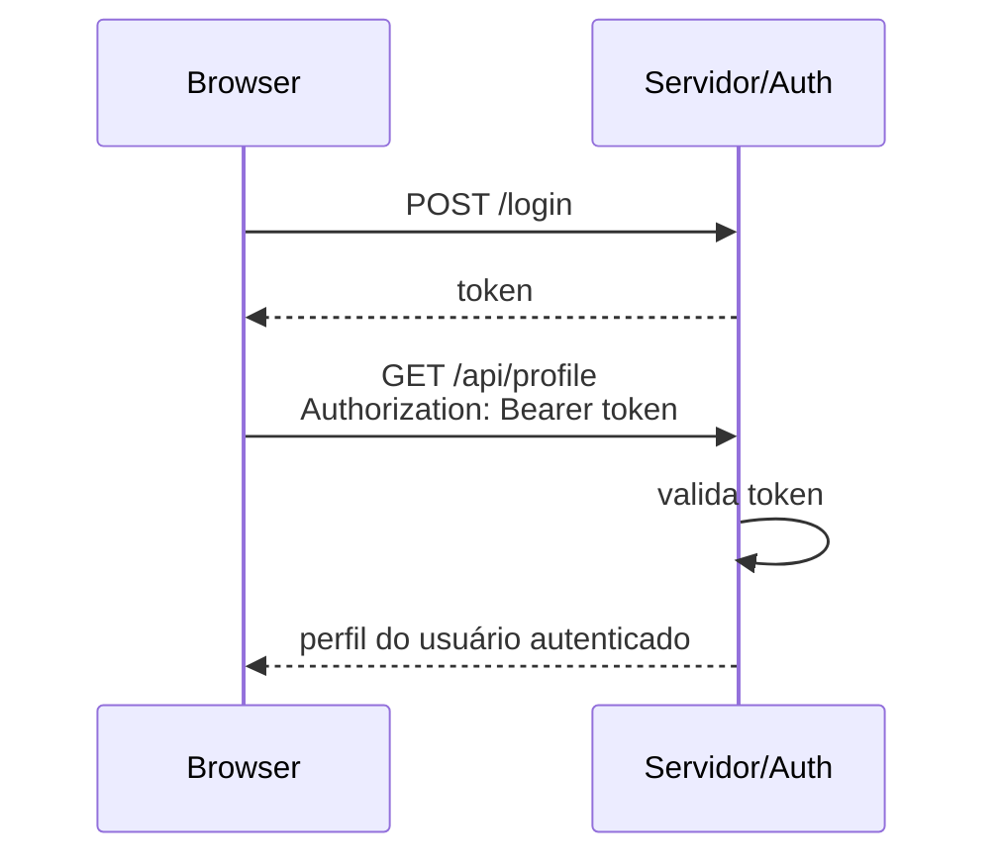
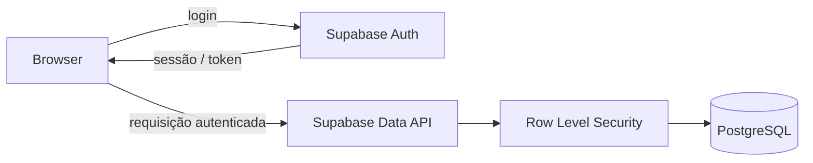
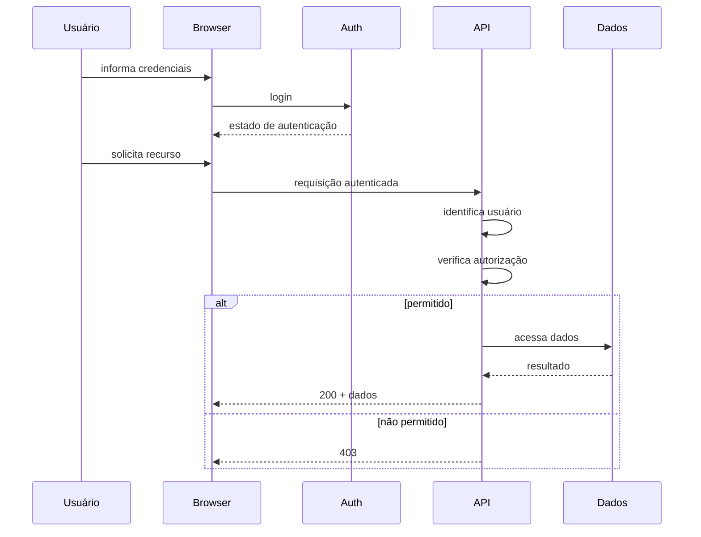

<!--
author:   Andrea Charão

email:    andrea@inf.ufsm.br

version:  0.0.1

language: PT-BR

narrator: Brazilian Portuguese Female

comment:  Material de apoio para a disciplina
          ELC1090 - Desenvolvimento de Software para Web
          da Universidade Federal de Santa Maria

translation: English  translations/English.md

import: https://raw.githubusercontent.com/liaScript/mermaid_template/master/README.md
-->

<!--
liascript-devserver --input README.md --port 3001 --live
https://liascript.github.io/course/?https://raw.githubusercontent.com/AndreaInfUFSM/elc1090-2026b/master/classes/19/README.md
-->


[](https://liascript.github.io/course/?https://raw.githubusercontent.com/AndreaInfUFSM/elc1090-2026b/master/classes/19/README.md)


# Cliente, servidor e identidade

> Do segundo projeto ao terceiro: o que muda quando a aplicação precisa saber **quem está fazendo a requisição**?

## Antes de começar

Nos projetos anteriores, vocês já trabalharam com aplicações que:

- executam código no navegador;
- buscam e enviam dados;
- usam APIs;
- persistem dados em algum lugar.

Agora vamos olhar mais de perto para **o que acontece entre uma ação no navegador e uma resposta do servidor**.

E então acrescentar uma pergunta nova:

> **Quem está fazendo esta requisição?**

---

### Quiz 1

Uma aplicação executa no navegador:

```javascript
const response = await fetch("/api/products");
const products = await response.json();
```

Quem normalmente lê os produtos do banco de dados?

[( )] O navegador, pois tudo passa por ele
[( )] A função `fetch` do JavaScript
[(X)] O servidor que atende `/api/products`
[( )] O HTML da página

---

### Quiz 2

Uma aplicação usa Supabase diretamente no frontend:

```javascript
const { data } = await supabase
  .from("products")
  .select("*");
```

Isso significa que não existe interação cliente-servidor?

[( )] Sim: o navegador acessa diretamente o banco de dados
[(X)] Não: o cliente está usando serviços/APIs fornecidos pelo Supabase
[( )] Sim: bibliotecas JavaScript eliminam a necessidade de servidores
[( )] Depende apenas do navegador
[[?]] Pense em onde os dados persistem e quem recebe a requisição enviada pelo navegador.


### Quiz 3

Considere um usuário com seu id (p.ex. id 17). Esse usuário está autenticado e altera uma requisição de:

```text
GET /api/users/17
```

para:

```text
GET /api/users/18
```

e consegue visualizar os dados do usuário 18.

Qual é o principal problema?

[( )] Falha de HTML
[( )] Falha de autenticação
[( )] Falha de persistência
[(X)] Falha de autorização


### O que já construímos?

No segundo projeto, apareceram arquiteturas/abstrações ligeiramente diferentes.



ou:



As ferramentas são diferentes, mas a ideia fundamental é muito parecida:

> **um cliente pede alguma coisa a outro componente pela rede e recebe uma resposta.**

[^supabase]: No caso do Supabase, boa parte do backend já é fornecida como serviço: armazenamento, APIs, autenticação, acesso ao PostgreSQL, regras de segurança, etc.


## Interação cliente-servidor





---

### Seguindo uma requisição

No **frontend**:

```javascript
const response = await fetch("/api/tasks");

if (!response.ok) {
  throw new Error("Erro ao carregar tarefas");
}

const tasks = await response.json();
```

No **servidor**:

```javascript
app.get("/api/tasks", async (req, res) => {
  const tasks = await db.getTasks();
  res.json(tasks);
});
```

> Dois trechos de código diferentes descrevem **os dois lados da mesma interação**.


---


### Trechos do segundo projeto


Frontend: https://github.com/elc1090/project2-2026b-renatasfon/blob/main/frontend/script.js#L238

```javascript
async function carregarPedidos() {
    try {
        const resposta = await fetch("/pedidos");
        const pedidos = await resposta.json();

        if (!resposta.ok) {
            exibirMensagem("Não foi possível carregar os pedidos.", "erro");
            return;
        }

        // Código que atualiza a página com os dados
    } catch (erro) {
        console.error("Erro ao carregar pedidos:", erro);
        exibirMensagem("Não foi possível conectar com o servidor.", "erro");
    }
}
```

Backend: 
https://github.com/elc1090/project2-2026b-renatasfon/blob/main/src/controllers/pedidos.controller.ts#L4


```typescript
export async function listarPedidos(req: Request, res: Response) {
    try {
        const pedidos = await prisma.pedido.findMany({
            // Argumentos da busca de pedidos (Prisma ORM)
        });
        res.json(pedidos);
    } catch (erro) {
        return res.status(500).json({
            erro: "Erro interno do servidor."
        });
    }
}
```


Perguntas:

- Onde cada código executa?
- Para onde a requisição é enviada?
- Quem produz a resposta?
- Onde estão os dados?
- O que o cliente precisa saber sobre a implementação do servidor?


---

### Cliente e servidor: correspondências

| Cliente | Servidor |
| --- | --- |
| `fetch("/api/tasks")` | `app.get("/api/tasks", ...)` |
| método HTTP | rota + método |
| headers | `req.headers` |
| body | `req.body` |
| espera resposta | `res.status(...)` |
| `response.json()` | `res.json(...)` |

Não é necessário decorar uma API específica, mas reconhecer o **protocolo da conversa**.

---

### API: conversa organizada

Uma API define **como componentes conversam**.

O cliente precisa conhecer, por exemplo:

```text
GET /api/items
POST /api/items
DELETE /api/items/:id
```

e o formato dos dados:

```json
{
  "id": 42,
  "name": "Exemplo"
}
```

Mas não deveria precisar saber:

- qual SQL foi executado
- como as tabelas foram organizadas
- qual função interna implementou a operação

> API = **interface entre componentes**, não simplesmente "um arquivo com rotas"

---


### Exemplo: Swagger Petstore

- OpenAPI é um formato padrão de descrição para APIs de aplicações web
  - usado para definir endpoints, parâmetros e respostas de forma que humanos e máquinas possam ler facilmente
- Swagger é uma ferramenta que ajuda a projetar, construir, documentar e testar APIs
  - Usa OpenAPI como formato de descrição
- Live playground: https://petstore3.swagger.io/

### HTTP: o envelope da conversa

Uma requisição possui informações como:

```text
POST /api/items HTTP/1.1
Content-Type: application/json

{
  "name": "Novo item"
}
```

Uma resposta pode ser:

```text
HTTP/1.1 201 Created
Content-Type: application/json

{
  "id": 43,
  "name": "Novo item"
}
```

Na prática, **frameworks** escondem boa parte desse texto, mas ele continua existindo.

[^http]: Além do método, URL e corpo, requisições e respostas podem carregar headers, cookies, informações de cache, tipo de conteúdo, credenciais e vários outros metadados.

---

### DevTools ajudam a enxergar

No DevTools → **Network** podemos observar:

- URL;
- método;
- status;
- headers;
- payload enviado;
- resposta recebida;
- tempo da requisição.


---

### Códigos de status

Ver: https://developer.mozilla.org/en-US/docs/Web/HTTP/Reference/Status

Alguns códigos muito comuns:

| Status | Ideia |
| --- | --- |
| `200` | operação concluída |
| `201` | recurso criado |
| `400` | requisição inválida |
| `401` | autenticação necessária ou inválida |
| `403` | usuário identificado, mas sem permissão |
| `404` | recurso não encontrado |
| `500` | erro no servidor |

O corpo da resposta explica detalhes.

O status comunica uma **categoria do resultado**.

---

# E quando aparece um usuário?

Até aqui, podemos imaginar:

```text
GET /api/products
```

Mas agora queremos operações como:

```text
GET /api/my-profile
GET /api/my-orders
POST /api/my-comments
DELETE /api/my-account
```

Surge um problema novo:

> Como o servidor sabe **quem é "me"**?

---

## Três perguntas diferentes

**1. Identificação**

> Quem você diz que é?

```text
email: ana@example.com
```

**2. Autenticação**

> Como posso verificar que você é essa pessoa?

```text
credencial → verificação
```

**3. Autorização**

> Sabendo quem você é, pode realizar esta operação?

```text
usuário autenticado + recurso + ação → permitir ou negar
```


### Autenticação X Autorização



> **Autenticar** responde *"quem é?"*  
> **Autorizar** responde *"pode fazer isto?"*

Essas decisões podem ocorrer em momentos e componentes diferentes.

---

### Quiz 4

O frontend possui:

```javascript
if (user.role === "admin") {
  deleteButton.hidden = false;
}
```

Isso é suficiente para proteger a operação de exclusão?

[( )] Sim, porque usuários comuns não enxergam o botão
[( )] Sim, se o JavaScript estiver minificado
[(X)] Não, porque o cliente está sob controle do usuário
[( )] Não, porque JavaScript não suporta autorização
[[?]] Pense: É possível enviar uma requisição HTTP sem clicar no botão da interface?

---

### Frontend X Segurança

No cliente podemos fazer:

```javascript
if (user.role === "admin") {
  showAdminControls();
}
```

Isso melhora a **experiência da interface**.

Mas o servidor ainda deve verificar:

```javascript
app.delete("/api/users/:id", requireAdmin, async (req, res) => {
  // ...
});
```

> O cliente pode decidir **o que mostrar**.  
> O servidor deve decidir **o que permitir**.

---

### Por que não só no front?

Porque o usuário controla o cliente.

Ele pode:

- alterar JavaScript;
- modificar parâmetros;
- repetir requisições;
- criar uma requisição fora da interface;
- alterar dados enviados.



O servidor não deve concluir:

> "Se o frontend enviou, deve estar tudo certo."


---

## Exemplo de autorização

Imagine:

```text
DELETE /api/tasks/37
```

A tarefa `37` pertence ao usuário `12`.

A requisição vem do usuário `12`:

```text
usuário autenticado = 12
recurso.owner = 12

→ permitir
```

Mas se vem do usuário `19`:

```text
usuário autenticado = 19
recurso.owner = 12

→ negar
```

A autorização depende da relação entre:

> **usuário + ação + recurso**

---

### Quiz 5

Considere:

```javascript
fetch(`/api/users/${currentUser.id}/profile`);
```

O servidor pode confiar que o `id` recebido na URL corresponde ao usuário autenticado?

[( )] Sim, porque o frontend conhece `currentUser`
[( )] Sim, se a aplicação usa HTTPS
[( )] Não, por isso IDs nunca devem aparecer em URLs
[(X)] Não, o servidor precisa relacionar a requisição à identidade autenticada

---

# Login: o início

Um login pode começar assim:




> Cinco segundos depois chega outra requisição.  
> **Como o servidor sabe que é o mesmo usuário?**

---

## Manter identidade entre requisições

- HTTP não transforma automaticamente duas requisições em uma "conversa autenticada".

- Precisamos de algum mecanismo que ligue novas requisições a uma identidade autenticada.

- Duas soluções comuns:

  - **sessão + cookie**;
  - **token**.

- Hoje interessa primeiro compreender **o problema que elas resolvem**. Os detalhes de implementação vêm depois.

---

### Sessão + cookie

Uma versão simplificada:



O identificador no cookie não precisa conter todos os dados do usuário, só permitir que o servidor encontre a sessão.

---

### Token

Outra possibilidade:



Novamente, a ideia fundamental:

> cada requisição protegida precisa carregar informação suficiente para que o servidor possa estabelecer a identidade do usuário.

[^token]: Existem muitos formatos e estratégias de token. JWT (JSON Web Token)  é apenas uma delas. "Token" e "JWT" não são sinônimos.


---

## E no Supabase?

Em uma aplicação com Supabase, podemos ter algo como:

```javascript
const { data, error } =
  await supabase.auth.signInWithPassword({
    email,
    password
  });
```

e depois:

```javascript
const { data } = await supabase
  .from("tasks")
  .select("*");
```

O código é curto, abstrai detalhes, mas a arquitetura continua existindo.

---

### Supabase também tem servidor



O Supabase fornece componentes que, em outra arquitetura, vocês poderiam implementar ou configurar separadamente.

Isso muda **quem implementa cada parte**.

Não elimina:

- autenticação;
- autorização;
- API;
- servidor;
- persistência.

---

### Autorização perto dos dados

No Supabase, uma política de **Row Level Security** (RLS) pode expressar regras do tipo:

```sql
user_id = auth.uid()
```

Conceitualmente:

```text
usuário autenticado
        +
linha que está sendo acessada
        ↓
regra de autorização
```

É a mesma pergunta que fizemos antes:

> Este usuário pode executar esta operação **neste recurso**?

[^RLS]: A sintaxe exata das políticas depende do caso. Aqui interessa a ideia arquitetural: a autorização pode ser aplicada muito perto da camada de dados.

---

# A interação completa



Esse fluxo é mais importante que o nome da biblioteca usada para implementá-lo.

---

## Quiz 6

Qual afirmação é correta?

[(X)] Autenticação estabelece identidade; autorização decide o que essa identidade pode fazer
[( )] Se o login funcionou, qualquer operação do usuário está autorizada
[( )] Autenticação acontece no frontend; autorização acontece no backend
[( )] APIs autenticadas não usam HTTP

---

## Quiz 7

Uma requisição para um recurso protegido chega **sem uma identidade autenticada válida**.

Qual resposta é conceitualmente mais adequada?

[( )] `200` (operação concluída)
[(X)] `401` (autenticação necessária ou inválida)
[( )] `403` (usuário identificado, mas sem permissão)
[( )] `500` (erro no servidor)

---

## Quiz 8

Uma requisição chega de um usuário corretamente autenticado, mas ele não possui permissão para a operação.

Qual resposta é conceitualmente mais adequada?

[( )] `201` (recurso criado)
[( )] `401` (autenticação necessária ou inválida)
[(X)] `403` (usuário identificado, mas sem permissão)
[( )] `404` (recurso não encontrado)

---

## Quiz 9

Ordene mentalmente os acontecimentos:

- A) servidor identifica o usuário
- B) usuário envia credenciais
- C) cliente solicita um recurso protegido
- D) servidor verifica autorização
- E) servidor verifica as credenciais
- F) cliente recebe estado de autenticação

Qual sequência representa melhor o fluxo?

[(X)] B → E → F → C → A → D
[( )] B → A → E → F → C → D
[( )] C → D → B → E → A → F
[( )] B → E → D → F → C → A

---

# O que muda no terceiro projeto?

> Não basta ter uma tela de login!

Agora vocês precisarão raciocinar explicitamente sobre:

1. Quem pode usar a aplicação?
2. Como a identidade será autenticada?
3. Como as requisições seguintes carregam essa identidade?
4. Quais recursos cada usuário pode acessar?
5. Onde essas regras de autorização serão garantidas?


---

## Antes da próxima aula

Escolha uma operação do seu **segundo projeto** e tente descrevê-la assim:

```text
AÇÃO DO USUÁRIO
      ↓
CÓDIGO NO CLIENTE
      ↓
REQUISIÇÃO
      ↓
API / SERVIÇO
      ↓
PERSISTÊNCIA
      ↓
RESPOSTA
      ↓
ATUALIZAÇÃO DA INTERFACE
```

Depois imagine:

> **o que precisaria mudar se essa operação dependesse do usuário autenticado?**
